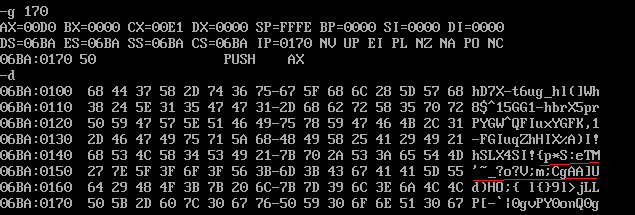
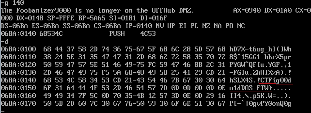

# Floppy 2

The game makes us look back at out com file. Remember is said it does nothing? Well, I was wrong, apparently.

It's pretty hard to debug these things nowdays, but with `DosBox` and `[DEBUG](http://www.softpedia.com/get/Programming/Debuggers-Decompilers-Dissasemblers/DOS-Debug.shtml)`
command it might be something.

From the disassembly (using IDA or anything else that can read these monsters) you might see a classic encrypted script that decrypts itself, so I let it run for a moment, while checking memory.

1. Use `g <offset>` to let it run till `offset` 
2. Use `u <offset> <len>` to disassemble from `offset` `len` bytes
3. Use `d` to dump memory

No time for patient decryption, the _entry point_ is at `100` so just let it run till `170` or something and let's check what it shows: 

As you can see, there might be something looking like a flag, but it's not there.

Let's try `140`

Nice, we found the flag `CTF{g00do1dDOS-FTW}`.

